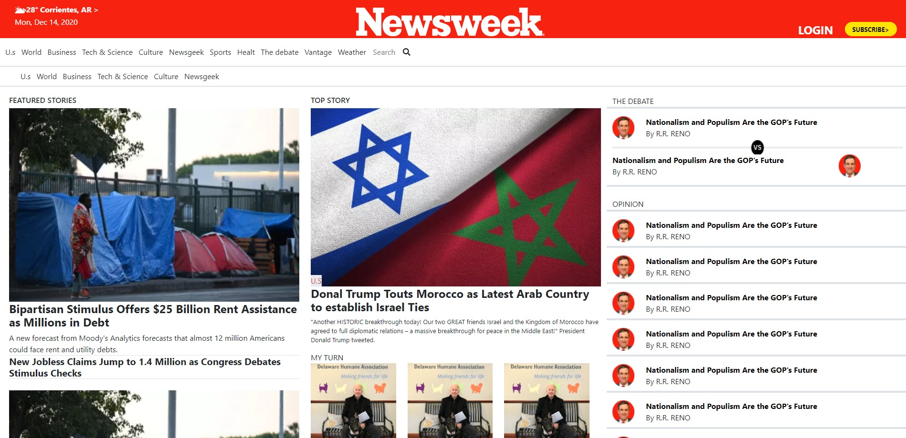

# NewsWeek-Site-clone-

**This Page is a clone of a NewsWeek site**

# Getting started :

this webpage can be viewed better on the screen size of 1920 X 1080 in Google Chrome browser.
you can also download the repo and open the "index.html" file with Mozilla Firefox or Google Chrome.

The purpose of this project is to create a similar looking webpage like the NewsWeek webpage, using HTML, CSS and BootStrap.

To visit the page go to the [Live Demo Link](https://fdi96.github.io/Bootstrap-Project/)

# Prerequisites :

1- A Computer.

2 - An internet browser.

## BUILT WITH

    -HTML
    -CSS

## LIVE DEMO

[Live Demo Link](https://fdi96.github.io/Bootstrap-Project/)

## AUTHORS

👤 **Widzmarc Jean Nesly Phelle**

- GitHub: [@widzthedvloper](https://github.com/widzthedvloper)
- Twitter: [@widzthedvloper](https://twitter.com/widzthedvloper)
- LinkedIn: [widzthedvloper](https://www.linkedin.com/in/widzmarc-jean-nesly-phelle-252a26129/)

👤 **Federico Ignacio Lopez Cechini**

- GitHub: [@FdI96](https://github.com/FdI96)
- Twitter: [@federicolopezc7 ](https://twitter.com/federicolopezc7)
- LinkedIn: [Federico Ignacio](https://www.linkedin.com/in/federico-ignacio-3285411a4/)

## SHOW YOUR SUPPORT

**Give a ⭐️ if you like this project!**

## 🤝 Contributing

Contributions, issues, and feature requests are welcome!

Feel free to check the issues page. Show your support

Give a ⭐️ if you like this project!

## 📝 Licensed MIT

This project is  licensed.
